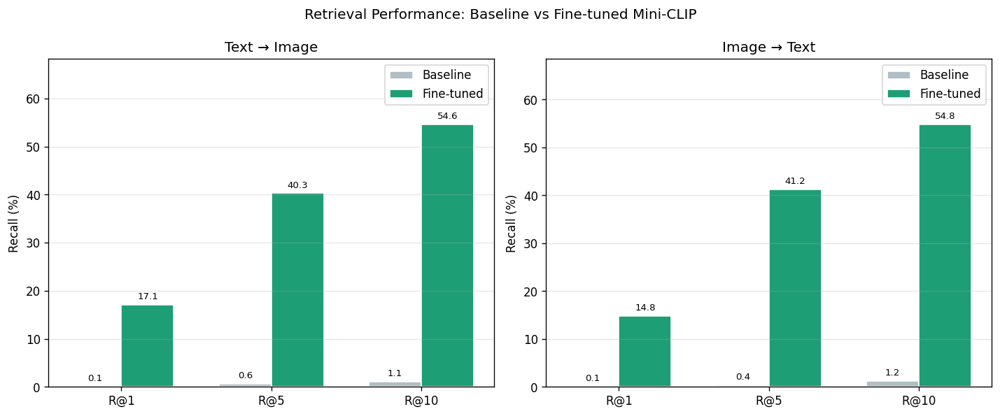
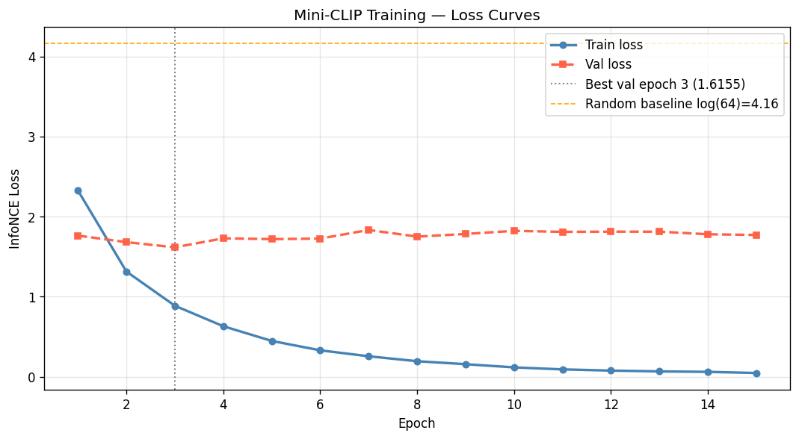
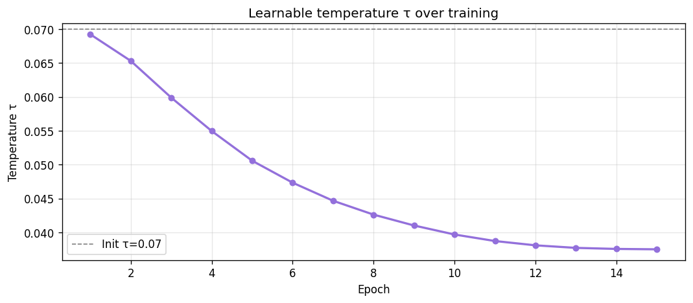
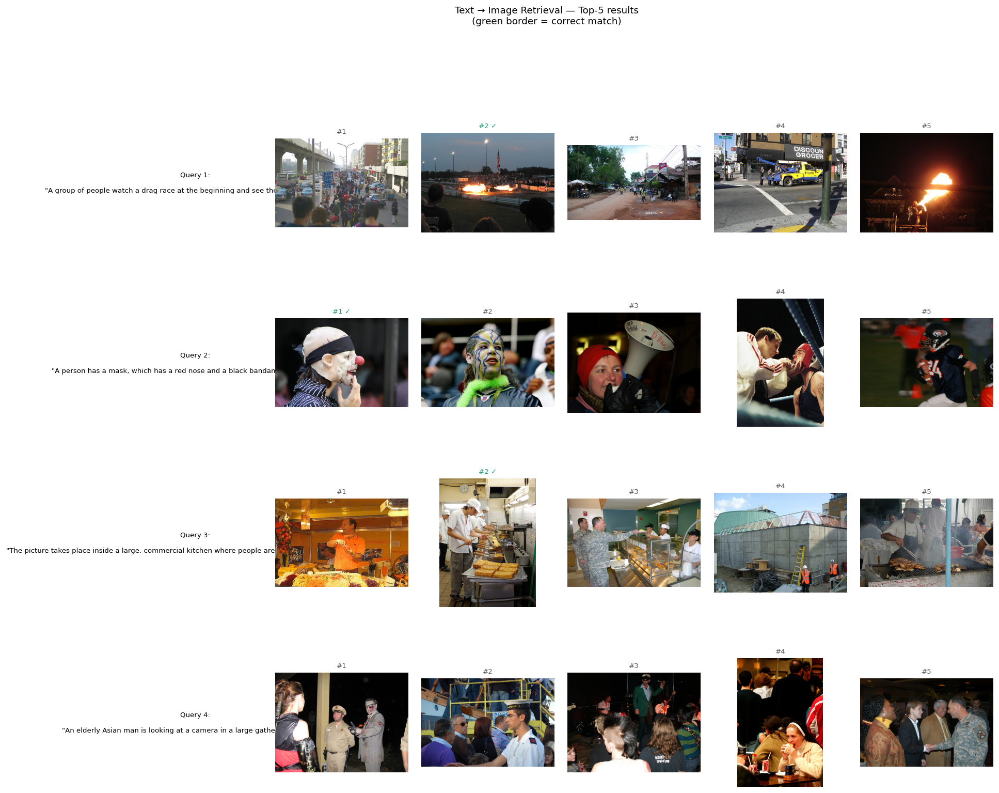

# Mini CLIP — Image-Text Contrastive Learning
**DLAI 2025/2026 Project** · Sapienza University of Rome

A small-scale PyTorch reproduction of [CLIP (Radford et al., 2021)](https://arxiv.org/abs/2103.00020) trained on a subset of the Flickr30k dataset. The model learns to project images and captions into a shared embedding space using contrastive learning, evaluated on zero-shot image-to-text and text-to-image retrieval.

---

## 🚀 Project Overview

This repository implements a dual-encoder model using:
*   **Image Encoder:** ResNet-50 pretrained backbone with a trainable projection head.
*   **Text Encoder:** DistilBERT pretrained backbone with a trainable projection head.
*   **Loss Function:** Symmetric InfoNCE contrastive loss with a learnable temperature parameter.
*   **Dataset:** Subset of Flickr30k (10,000 image-caption pairs), split into:
    *   **Train:** 8,000 samples
    *   **Validation:** 1,000 samples
    *   **Test:** 1,000 samples

---

## 📂 Repository Structure

The project is structured as follows:

```
├── assets/                       # Performance plots and visualizations
│   ├── loss_curves.png           # Training and validation InfoNCE loss curve
│   ├── overfit_test_loss.png     # Loss curves for the small batch overfit test
│   ├── recall_results.png        # Bar chart comparing baseline vs. fine-tuned recall
│   ├── retrieval_examples.png    # Qualitative Top-5 text-to-image retrieval results
│   ├── similarity_matrix_after_10_steps.png # Logits similarity matrix after 10 steps of training
│   ├── similarity_matrix_before_training.png # Logits similarity matrix before training starts
│   ├── temperature_effect.png    # Visualization of the scaling effect of temperature (τ)
│   └── temperature_history.png   # Learnable temperature (τ) evolution plot
├── src/                          # Core source code module
│   ├── __init__.py               # Python package initialization
│   ├── dataset.py                # Dataset class, transforms, and dataloaders
│   ├── evaluate.py               # Recall@K evaluation metrics & visualization functions
│   ├── loss.py                   # Symmetric InfoNCE CLIP loss function
│   ├── model_architecture.py     # ResNet-50 + DistilBERT encoders & projection heads
│   └── train.py                  # Training and validation loops, checkpoint helpers
├── Notebook_output_pdf/          # Exported PDF copies of code execution notebooks
│   ├── data_exploration.pdf      # PDF export of Flickr30k exploration notebook
│   ├── evaluation.pdf            # PDF export of quantitative & qualitative evaluation
│   ├── loss_integration.pdf      # PDF export of loss validation & overfit test
│   ├── model_arch_output.pdf     # PDF export of embedding dimension validation
│   └── training.pdf              # PDF export of model training execution
├── .gitignore                    # Ignored files for git
├── data_exploration.ipynb        # Jupyter notebook for Flickr30k exploration
├── loss_integration.ipynb        # Notebook for loss validation & overfitting sanity checks
├── model_architecture.ipynb      # Notebook validating embedding dimensions and projection heads
├── training.ipynb                # Main notebook for training the CLIP model
├── evaluation.ipynb              # Notebook for quantitative & qualitative evaluation
├── requirements.txt              # Required python dependencies
└── README.md                     # This file
```

---

## 🏗️ Model Architecture

### Image Encoder
*   **Backbone:** `torchvision.models.resnet50(weights=IMAGENET1K_V1)`.
*   **Freezing Strategy:** Early layers (`conv1`, `bn1`, `layer1`, `layer2`, `layer3`) are frozen. Only `layer4` and the projection head are trained.
*   **Projection Head:** A linear layer projecting features from 2,048 dimensions to a **256-dimensional shared embedding space**, followed by Layer Normalization and L2 normalization.

### Text Encoder
*   **Backbone:** `transformers.DistilBertModel` (`distilbert-base-uncased`).
*   **Freezing Strategy:** Early transformer layers (layers 0 and 1) and the token embedding lookup table are frozen to prevent overfitting.
*   **Projection Head:** Projects the output of the CLS token (768 dimensions) to the **256-dimensional shared embedding space**, followed by Layer Normalization and L2 normalization.

---

## ⚙️ Training Configurations & Hyperparameters

The model is optimized using the following parameters:

| Hyperparameter | Value | Description |
| :--- | :--- | :--- |
| **Embedding Dim** | 256 | Dimension of the shared latent space |
| **Max Length** | 77 | Maximum sequence token length for text tokenizer |
| **Batch Size** | 64 | Batch size for training, validation, and test loaders |
| **Num Epochs** | 15 | Total training epochs |
| **Encoder LR** | $1 \times 10^{-4}$ | Learning rate for trainable layers of the backbones |
| **Projection LR** | $1 \times 10^{-3}$ | Learning rate for projection heads and log-temperature |
| **Weight Decay** | $1 \times 10^{-2}$ | L2 regularization weight decay |
| **Max Grad Norm** | 1.0 | Gradient clipping threshold |
| **Scheduler** | CosineAnnealingLR | Cosine annealing schedule decaying LR to $1 \times 10^{-6}$ |
| **Init Temperature** | 0.07 | Initial value for the learnable temperature parameter $\tau$ |

---

## 📊 Evaluation Results

Performance is measured on the 1,000-sample test set using **Recall@K (R@1, R@5, R@10)**.

The **Baseline** represents frozen pretrained encoders with randomly initialized projection heads (no fine-tuning). The **Fine-tuned** model corresponds to training the projection heads and late backbone layers for 15 epochs.

### Recall@K Performance Table

| Metric | Direction | Baseline | Fine-Tuned | $\Delta$ Gain |
| :--- | :--- | :---: | :---: | :---: |
| **R@1** | Text $\rightarrow$ Image | 0.10% | 17.10% | +17.00% |
| **R@5** | Text $\rightarrow$ Image | 0.60% | 40.30% | +39.70% |
| **R@10** | Text $\rightarrow$ Image | 1.10% | 54.60% | +53.50% |
| **R@1** | Image $\rightarrow$ Text | 0.10% | 14.80% | +14.70% |
| **R@5** | Image $\rightarrow$ Text | 0.40% | 41.20% | +40.80% |
| **R@10** | Image $\rightarrow$ Text | 1.20% | 54.80% | +53.60% |

### Visualizations

#### 1. Retrieval Performance Comparison
The fine-tuning process yields substantial gains, mapping random features into a structurally organized cross-modal embedding space.


#### 2. Loss Curves
The symmetric InfoNCE loss steadily decreases, showing stable convergence with the learning rate scheduler.


#### 3. Learnable Temperature Evolution
The temperature parameter $\tau$ is learned automatically, scaling the logit similarities to optimize contrastive boundaries.


#### 4. Qualitative Results (Top-5 Text $\rightarrow$ Image Retrieval)
A demonstration showing top matches retrieved for query captions (green border denotes the ground-truth image):


---

## 🛠️ Installation & Setup

1.  **Clone the Repository:**
    ```bash
    git clone https://github.com/prajwl7676/mini-clip-DLAI.git
    cd mini-clip-DLAI
    ```

2.  **Install Dependencies:**
    ```bash
    pip install -r requirements.txt
    ```

3.  **Run Notebooks:**
    *   Open `training.ipynb` to execute the fine-tuning process.
    *   Open `evaluation.ipynb` to evaluate checkpoints and generate results/plots.

---

## 📚 Key References

*   Radford et al. (2021). [Learning Transferable Visual Models From Natural Language Supervision](https://arxiv.org/abs/2103.00020). OpenAI.
*   Young et al. (2014). [From image descriptions to visual denotations](https://aclanthology.org/Q14-1006/). Flickr30k dataset.
*   Oord et al. (2018). [Representation Learning with Contrastive Predictive Coding](https://arxiv.org/abs/1807.03748). InfoNCE loss.
*   [OpenAI CLIP Repository](https://github.com/openai/CLIP)
*   [HuggingFace CLIP Documentation](https://huggingface.co/docs/transformers/model_doc/clip)
